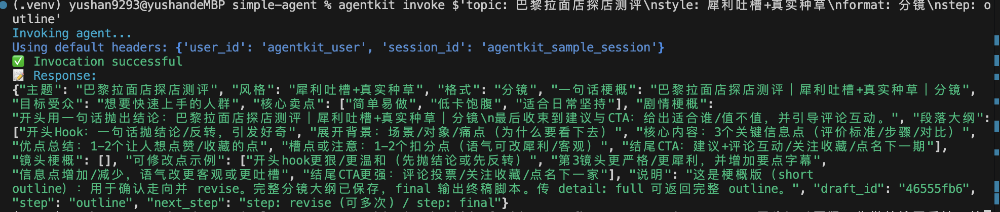
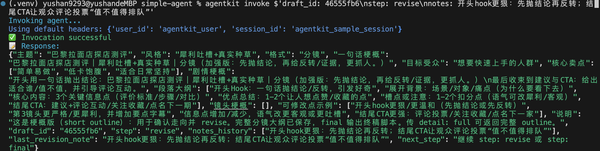
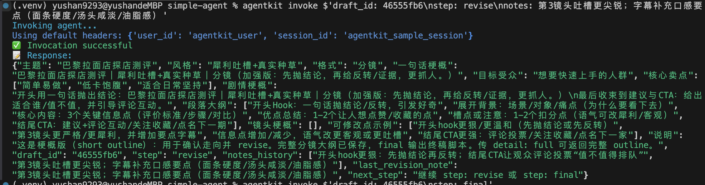
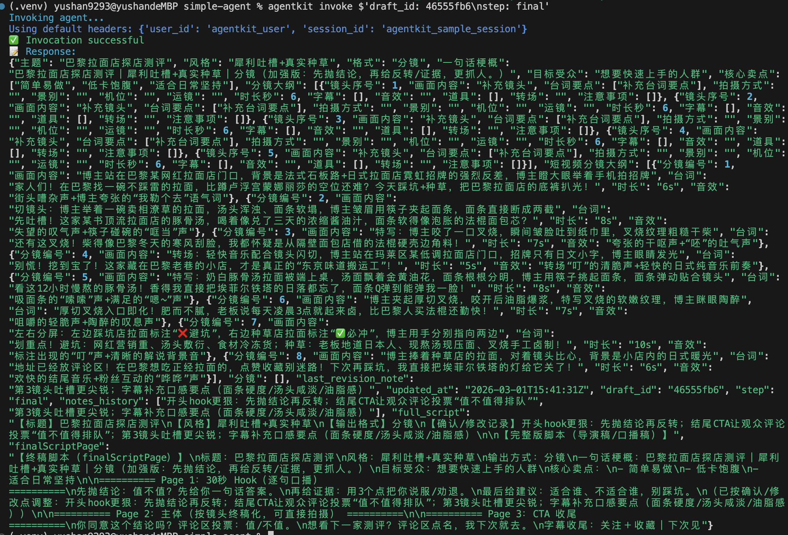

````markdown
# 短视频脚本/分镜 Agent（Volcengine AgentKit Demo）

本项目是一个基于火山 AgentKit 的**最小可运行 Demo（simple demo）**：  
用于根据用户输入的 `topic / style / format` 生成短视频脚本的**梗概版大纲（outline）**，支持多轮**修改确认（revise）**，最后生成**终稿脚本（final）**。

---

## ✅ 功能概览（Features）

- 参数输入：`topic / style / format`
- 三步工作流（3-step workflow）：
  - `outline`：生成**梗概版大纲**（含剧情梗概、段落大纲、镜头梗概）并返回 `draft_id`
  - `revise`：基于 `draft_id` 可多轮修改（记录 `notes_history`）
  - `final`：生成终稿脚本（`full_script` + `finalScriptPage`）
- 调试开关：`detail: full`  
  - 在 `outline/revise` 阶段输出完整 outline（用于精修/排查）
- 草稿持久化（Draft persistence）：  
  - draft 存在容器 `/tmp/agent_drafts`，避免多 worker 场景下内存不共享导致草稿丢失（可替换为 Redis/DB）

---

## 🚀 快速开始（Quick Start）

### 1）安装依赖（Install）
```bash
pip install -r requirements.txt
````

### 2）构建镜像并部署（Build & Deploy）

> 说明：以下命令会重新构建 Docker 镜像并通过 AgentKit 部署服务。

```bash
docker rm -f simple_agent-container 2>/dev/null || true
docker rmi -f simple_agent:latest 2>/dev/null || true
docker buildx build --platform linux/amd64 -t simple_agent:latest --no-cache .
agentkit deploy
```

### 3）健康检查（Health Check，可选）

```bash
curl -s http://127.0.0.1:8000/ping
```

---

## 🧩 使用方式（Usage）

### 参数说明（Parameters）

* `topic`：主题
* `style`：风格/口吻
* `format`：输出方式（本 Demo 主要输出“分镜结构”；终稿阶段输出“脚本形态”）
* `step`：流程步骤（`outline | revise | final`）
* `draft_id`：草稿 ID（outline 返回，用于 revise/final）
* `notes`：修改点（revise/final 可用）
* `detail`：详细度（`detail: full` 输出完整 outline，用于调试/精修）

---

## ① 生成梗概大纲（Outline）

> 生成“梗概版大纲”，用于快速确认方向；返回 `draft_id`。

```bash
agentkit invoke $'topic: 巴黎拉面店探店测评\nstyle: 犀利吐槽+真实种草\nformat: 分镜\nstep: outline'
```

---

## ② 多轮修改确认（Revise，可重复多次）

> 传入 `draft_id` + `notes`，可反复迭代；返回更新后的梗概版大纲，并记录 `notes_history`。

```bash
agentkit invoke $'draft_id: <PASTE_ID>\nstep: revise\nnotes: 开头hook更狠：先抛结论再反转；结尾CTA让观众评论投票“值不值得排队”'
```

---

## ③ 生成终稿（Final）

> 当你确认大纲满意后，执行 final 输出终稿：
>
> * `full_script`（导演稿/口播稿结构）
> * `finalScriptPage`（更长、更像两三页终稿）

```bash
agentkit invoke $'draft_id: <PASTE_ID>\nstep: final'
```

---

## （可选）输出完整大纲（detail: full）

> 用于调试/精修：在 outline 阶段输出完整分镜大纲（会比较长）。

```bash
agentkit invoke $'topic: 巴黎拉面店探店测评\nstyle: 犀利吐槽+真实种草\nformat: 分镜\nstep: outline\ndetail: full'
```

---

## 🎬 演示案例（Demo Case：1 组完整流程）

> Topic：巴黎拉面店探店测评
> Style：犀利吐槽 + 真实种草
> Format：分镜
> 流程：outline → revise → revise → final

### 1）Outline（梗概大纲）



### 2）Revise #1（修改确认 1）



### 3）Revise #2（修改确认 2）



### 4）Final（终稿输出：full_script + finalScriptPage）



---

## 🧠 设计说明（Design Notes）

* 为什么 outline 默认返回 short（梗概版）？

  * 便于快速确认方向，减少信息过载；如需完整大纲可使用 `detail: full`
* 为什么 draft 落盘到 `/tmp/agent_drafts`？

  * 避免多 worker/多进程环境下内存不共享导致草稿丢失（可替换为 Redis/DB）

---

## 📁 项目结构（Project Structure）

* `simple_agent.py`：入口（outline/revise/final、draft 存取、终稿生成）
* `agents/video_agent.py`：outline 生成逻辑
* `prompts/video_prompt.txt`：prompt
* `schemas/script_schema.py`：输出 schema

```

---

